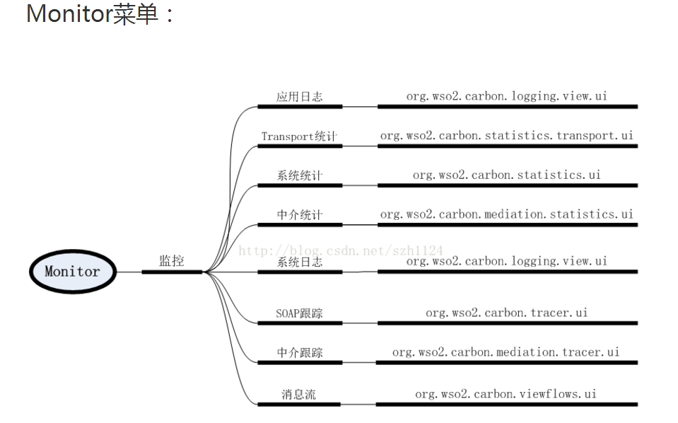

# 汉化WSO2ESB UI
WSO2 ESB专注于Web Service，比Mule轻量级，有UI，但这个UI是英文的，采用的是i18n的方式进行国际化和本地化，我们稍作修改就可以显示中文。此处以org.wso2.carbon.user.mgt.ui-5.2.0.jar 为例

## 目标项目汉化步骤
1. 在repository\components\plugins找到相关的UI bundles,解压缩
2. 找到Resources.properties文件和JSResouces.properties文件将每一行消息的值由英文翻译成中文(路径：C:\Users\hasee\Desktop\org\wso2\carbon\userstore\ui\i18n\Resources.properties)
3. 将修改好的中文资源文件用JDK转码工具native2ascii进行转码
4. 重新打包，用winrar打包成zip格式（要在目录下面选择所有文件夹打包，而不是将整个目录打包）
```
修改前properties文件内容如下：
```


```
修改后properties文件内容如下：
```


```
效果如下：
```


## 菜单与源文件具体对应关系



