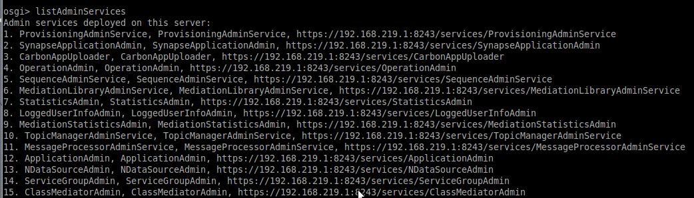

我们知道WSO2产品内部各组件之间都是通过基于SOAP协议的Web Service来交互的，这部分的服务可以叫做`管理服务`。我们也可以调用这些管理服务来完成ESB的各项功能，如：服务管理、用户管理等。

首先得知道有哪些`管理服务`可以调用，下面是查看的方法：
1. 打开`%ESB_HOME%/repository/conf/carbon.xml`文件，修改`<HideAdminServiceWSDLs>`节点值为false；
2. 使用参数`-DosgiConsole`启动`wso2server.bat`，如：`%ESB_HOME%/bin/wso2server.bat -DosgiConsole`；
3. 当服务启动之后，按一下回车，输入`listAdminServices`即可列出所有的管理服务，如下所示：

上图中列出的任意一个服务都可以调用，需要注意的是：
> 如果没有修改端口的偏移值，ESB 管理服务的端口是`9443`，而不是上图中所显示的`8243`。

[**示例代码**](./src.zip)中演示了通过Java调用这些管理服务来完成下面简单的几个功能：
1. 登录；
2. 查看所有服务；
3. 添加代理服务；
4. 删除代理服务。

更多的功能都可以通过这些`管理服务`来完成。