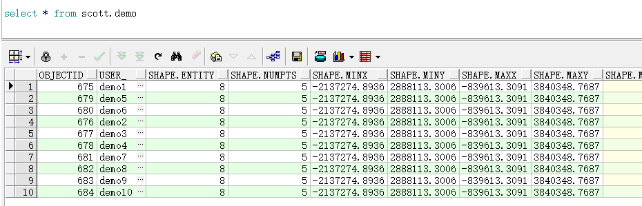

为了便于使用，我打包了一个项目到[公司私服](https://github.com/DistX/Learning/wiki/%E5%85%AC%E5%8F%B8nexus%E4%BD%BF%E7%94%A8)上面了，如下使用即可（有些依赖在中央仓库和私服没有，我自己安装到公司私服了）：
```xml
<dependency>
    <groupId>dist.xdata.product</groupId>
    <artifactId>dist-arcgis</artifactId>
    <version>1.0.0-RELEASE</version>
</dependency>
```
> 注意：需要配置[公司的私服](https://github.com/DistX/Learning/wiki/%E5%85%AC%E5%8F%B8nexus%E4%BD%BF%E7%94%A8)。

在这个jar中，目前我还没有封装任何的功能，后期会根据实际的使用加接口，便于操作空间表里面的数据。

### 插入数据示例
```java
Map params = new HashMap();
params.put( "dbtype", "arcsde"); //不可更改
params.put( "server", "127.0.0.1");
params.put( "port", 5151);
params.put( "instance", "sde");
params.put( "user", "scott" );
params.put( "password", "pass" );
try {
    DataStore dataStore = DataStoreFinder.getDataStore(params);
    ArcSdeFeatureStore featureStore = (ArcSdeFeatureStore)dataStore.getFeatureSource("SCOTT.DEMO");
    GeometryFactory geometryFactory = JTSFactoryFinder.getGeometryFactory();
    WKTReader reader = new WKTReader( geometryFactory );
    SimpleFeatureType featureType = featureStore.getSchema();
    SimpleFeatureBuilder featureBuilder = new SimpleFeatureBuilder(featureType);

    List features = new ArrayList<SimpleFeature>();
    final Polygon polygon = (Polygon) reader.read("POLYGON(( -1967313.96100000 3840348.76870000, -2137274.89360000 3177086.59270000, -1009574.24170000 2888113.30060000, -839613.30910000 3551375.47660000, -1967313.96100000 3840348.76870000))");
    Stream.iterate(1,i -> i+1).limit(1).forEach(i->{
        featureBuilder.add("demo"+i);
        featureBuilder.add(polygon);
        features.add(featureBuilder.buildFeature(null));
    });
    FeatureCollection featureCollection = new ListFeatureCollection(featureType,features);
    featureStore.addFeatures(featureCollection);
    //featureStore.getTransaction().commit();
    dataStore.dispose();
    System.out.println("数据插入成功");
}catch (Exception e){
    e.printStackTrace();
}
```
结果:



#### 参考
- [http://docs.geotools.org/latest/userguide/library/data/arcsde.html](http://docs.geotools.org/latest/userguide/library/data/arcsde.html)
- [http://help.arcgis.com/en/geodatabase/10.0/sdk/arcsde/api/japi/japi.htm](http://help.arcgis.com/en/geodatabase/10.0/sdk/arcsde/api/japi/japi.htm)