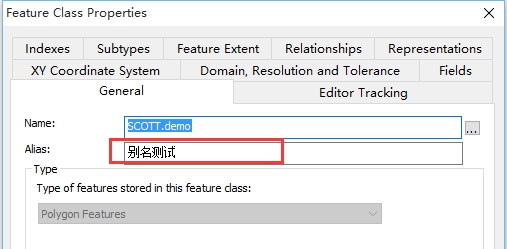
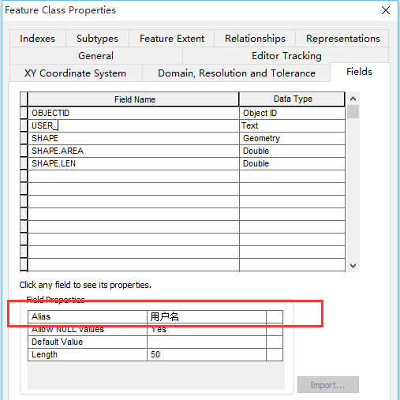
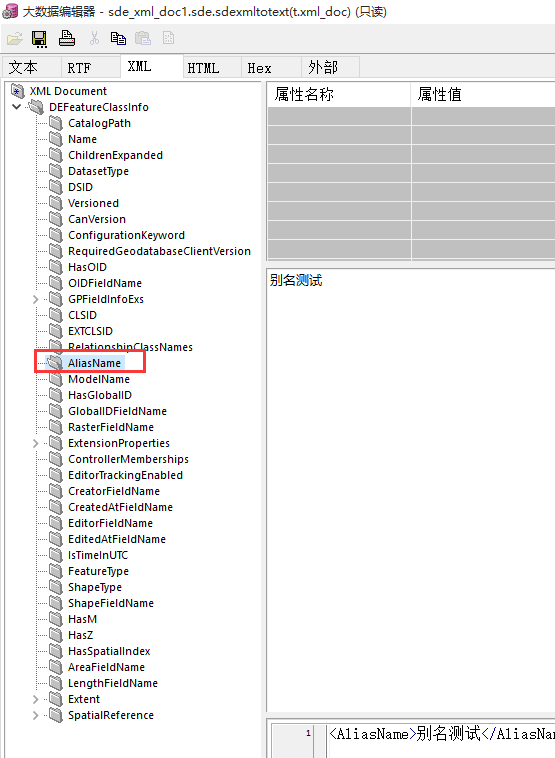
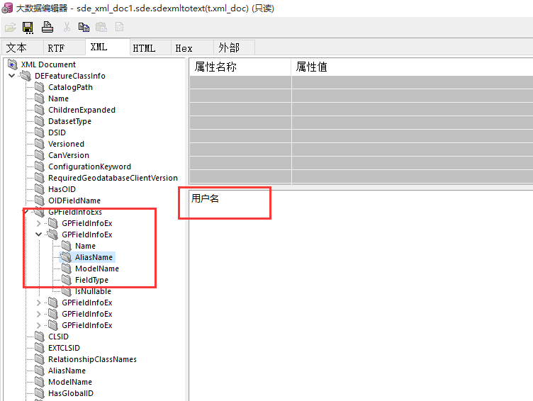

通过SDE库中的`GDB_ITEMS`表可以得到某个图层所属的数据集信息，但是无法获取图层的别名及其属性的别名，也不能获取到更多关于此图层的元数据信息。

想要得到在 ArcGIS Catalog 中看到的这些详细的元数据信息，可以通过其它的表得到(之前我们也一直忽略了这些表)。

比如给图层和字段设置了别名，通过SQL语句可以从SDE库中取出，如下所示：






### 从`GDB_ITEMS`取出`definition`
``` SQL
SQL> select t.definition from gdb_items t where t.physicalname='SCOTT.DEMO';

                             DEFINITION
---------------------------------------
                                    102
```
### 从`SDE_XML_DOC1`取出`xml_doc`
```SQL
SQL> select sde.sdexmltotext(t.xml_doc) from SDE_XML_DOC1 t where t.sde_xml_id = 102;
SDE.SDEXMLTOTEXT(T.XML_DOC)

--------------------------------------------------------------------------------
<DEFeatureClassInfo xsi:type='typens:DEFeatureClassInfo' xmlns:xsi='http://www.w

```
返回的结果是 CLOB 型(XML)的，通过PL/SQL查看可知：





### 提取指定节点值

通过oracle提供的xml相关函数可以提取指定节点数据，比如我这里提取出`图层别名`：
```SQL
SQL> select extractvalue(xmltype(sde.sdexmltotext(t.xml_doc)),'/DEFeatureClassInfo/AliasName') demo from sde.SDE_XML_DOC1 t where t.sde_xml_id = 102;
DEMO
--------------------------------------------------------------------------------
别名测试
```

其它XML函数还有：
- EXTRACT（XMLType_instance，Xpath_string）：返回XML节点路径下的相应内容
- EXTRACTVALUE（XMLType_instance,Xpath_string)：返回特定XML节点路径的数据
- EXISTSNODE（XMLType_instance，Xpath_string）：于确定特定的XML节点的路径是否存在，返回0表示节点不存在，返回1表示节点存在。
- XMLELEMENT(identifier[,xml_attribute_clause][,value_expr])：返回XMLType的实例。其中参数identifier用于指定元素名，参数xml_attribute_clause用于指定元素属性子句，参数value_expr用于指定元素值。
- ......

### SDE_XML_DOC1[/2/3/4] 表说明

默认情况下，这四张表存储如下数据：
- SDE_XML_DOC1：DEFINITION
- SDE_XML_DOC2：DOCUMENTATION
- SDE_XML_DOC3：ITEMINFO
- SDE_XML_DOC4：ATTRIBUTES

通过表`SDE_XML_COLUMNS`可得知对应关系。

### 参考
- [oracle 提供的 xml 操作函数](http://docs.oracle.com/cd/B28359_01/appdev.111/b28369/xdb04cre.htm#i1024810)
- [Arcgis SDE_XML_COLUMNS 表说明](http://resources.arcgis.com/zh-cn/help/main/10.1/index.html#//002n00000071000000)