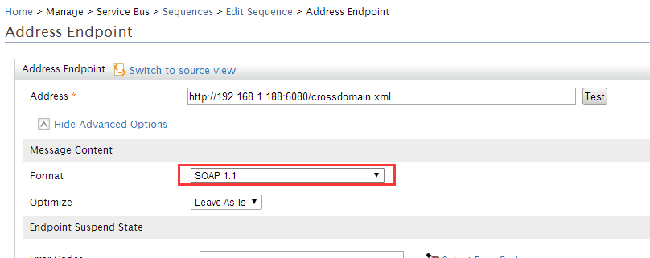

Flex 访问 Arcgis 服务之前，都会先访问一个跨域文件。

如果访问的服务为：
> [http://192.168.1.188:6080/arcgis/rest/services/DemoBJ/MapServer](http://192.168.1.188:6080/arcgis/rest/services/DemoBJ/MapServer)

则会访问此跨域文件：
> [http://192.168.1.188:6080/crossdomain.xml](http://192.168.1.188:6080/crossdomain.xml)

因此，如果我们在ESB中将地图服务代理出去，需要保证跨域文件同样也代理出去，比如：

地图服务代理出去后的地址为：
> [http://192.168.200.113:8280/services/demo](http://192.168.200.113:8280/services/demo)

那么，Arcgis 的 API 就会默认访问此地址来查找跨域文件：

> [http://192.168.200.113:8280/crossdomain.xml](http://192.168.200.113:8280/crossdomain.xml)

因此，需要在ESB对`http://192.168.200.113:8280/crossdomain.xml`地址进行代理，否则Flex会报出`安全沙漏问题`，服务就可用了。

配置方法，修改`main`序列（关注filte部分，后续可能会对main序列加上其它的逻辑判断，这个crossdomain只是一部分），如下所示：
```xml
<?xml version="1.0" encoding="UTF-8"?>
<sequence name="main" xmlns="http://ws.apache.org/ns/synapse">
    <in>
        <filter regex="/crossdomain\.xml" source="get-property('To')" xmlns:ns="http://org.apache.synapse/xsd">
            <then>
                <send>
                    <endpoint>
                        <address format="soap11" uri="http://192.168.200.113:8280/crossdomain.xml"/>
                    </endpoint>
                </send>
            </then>
            <else/>
        </filter>
    </in>
    <out>
        <send/>
    </out>
    <description>The main sequence for the message mediation</description>
</sequence>
```
> 注意：必须将上述配置中`address`的`format`属性设置为`soap11`或者`soap12`(目前暂不清楚原因)，如下图所示。

