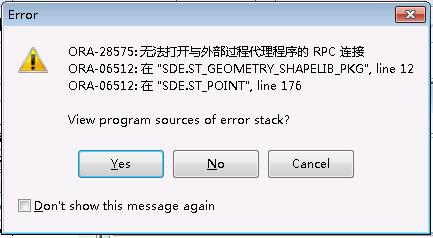

#SDE配置常见问题汇总 
##1、	SDE报错:  ORA-28575

 <br>
 <br>
 <br>
 ```
以上关于ORA-28575的报错，原因及解决方案如下：
```
```
报错原因1：Key值不一致
```
 
报错原因2：tnsnames.ora中SID值与listener.ora中SID_NAME值不一致

 
 
报错原因3：ArcSde Service(esri_sde)服务以及相关ArcGis服务还没有启动完全 ，此时如果立即启动oracle监听
OracleOraDb11g_home1TNSListener，也可能导致报错ORA-28575。<br>
情景模式：这种情况适用于解释原本SDE函数的使用是好的，突然某次开关机或者待机一段时间后就报错了，如果错误出现的情景基本如此，那么请优先尝试报错原因3对应的解决方案！
报错原因3对应解决方案：重启电脑(服务器)-->先启动OracleServiceORCL和ArcSde Service(esri_sde) -->等待15分钟左右(看电脑性能，总之是要等ArcGis服务启动完全之后)-->再手动启动监听OracleOraDb11g_home1TNSListener(如果设计的是开启自启动，请先更改为手动) -->测试
测试SDE： select sde.st_point(0,0,0) from dual;  成功


报错原因1/2情景模式：报错原因1/2适用于解释那些电脑刚安装好SDE或者修改过相关配置后SDE函数就无法使用的情况<br>
报错原因1/2的解决方案：这两对值需要一一对应  正确配置如下
注意：修改tnsnames.ora和listener.ora配置后，只需要重启oracle监听服务然后进行测试即可。

监听服务：OracleOraDb11g_home1TNSListener     
改过配置后，重启监听即可(亲测)(不需要重启SDE服务和ORACLE实例)
 
 
##2、	关于网上说的SDE用户的userlibraries和listener.ora的st_shapelib.dll的路径需要一致,亲测其实并不需要是指向同一个路径，只是路径指向的st_shapelib.dll这个文件需要是同一个版本。
注：测试1：将 E:\Program Files\ArcGIS\ArcSDE\ora11gexe\bin\st_shapelib.dll 复制到  
E:\app\Administrator\product\11.2.0\dbhome_1\BIN\ st_shapelib.dll  然后listener.ora文件中st_shapelib路径指定为：E:\Program Files\ArcGIS\ArcSDE\ora11gexe\bin\st_shapelib.dll  ； SDE用户的libraries路径指定为：
E:\app\Administrator\product\11.2.0\dbhome_1\BIN\st_shapelib.dll  ； <br>
		重启  OracleOraDb11g_home1TNSListener; <br>
		测试  select sde.st_point(0,0,0) from dual;  成功！<br>
       测试2：当尝试把SDE用户的libraries路径故意写错时，报错如下：<br>
 
 
测试3：当尝试把listener.ora中的st_shapelib.dll文件路径写错时，居然没有报错，此处很疑惑!!!???  <br>
注：要求大家肯定还是要写正确路径的，并且SDE用户的userlibraries和listener.ora的st_shapelib.dll的路径尽量保持一致(规范)

##如下是一些需要注意的细节问题<br>
##1、在重启监听时，容易遇到如下问题，此问题一般是因为PL/SQL还连着数据库，所以最好把oracle用户连接都先关闭了，再重启监听。<br>

 
```
 2、查看一下Oracle的监听状态，extproc（CLRextproc)的状态必须为静态（Unknow），如果是Ready状态就有可能出现问题，
 而且Oracle监听必须同时监听TCP和IPC
```
 
```
3、案例研究
```
```
案例1  中江多规合一部署  报错ORA-28575及解决
```
 
```
结论：通过方案3，解决问题。不过报错根本原因无从得知。
``` 
```
案例2  淮安多规合一现场演示机部署  报错ORA-28575及解决
```
 
```
检查发现，配置并没有问题；重启服务器，稍等15分钟再手动启动ORACLE监听，还是无效。即方案1/2/3全部失效。
测试其他方法：删除HADG.JSFAFW图层数据(包含有一些历史数据)和DG_PROJECT表数据，
没有重启tomcat，SDE直接好了，可以正常上传空间位置了。
```	
```
判断问题：1.受历史数据的影响？推理：要影响早影响了，故排除。
	 2.受图层位置有叠加或者互相包含的影响？推理：有可能，但是亲测并不存在。
```
```
推理2测试：图形位置可以上传成功。
```
 
 ```
淮安多规结论：对于SDE函数突然报错ORA-28575，导致无法使用，还是没有找到根本原因。
```
