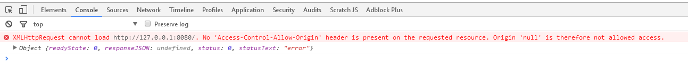
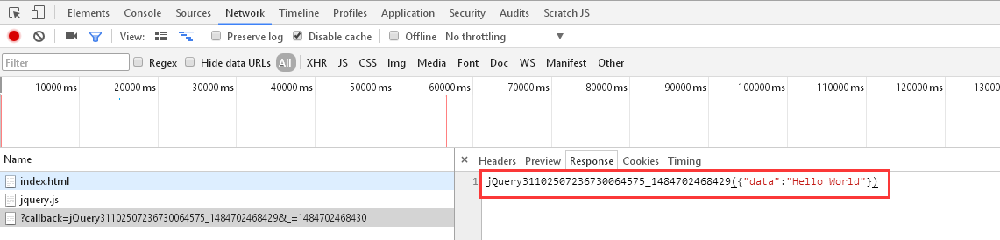
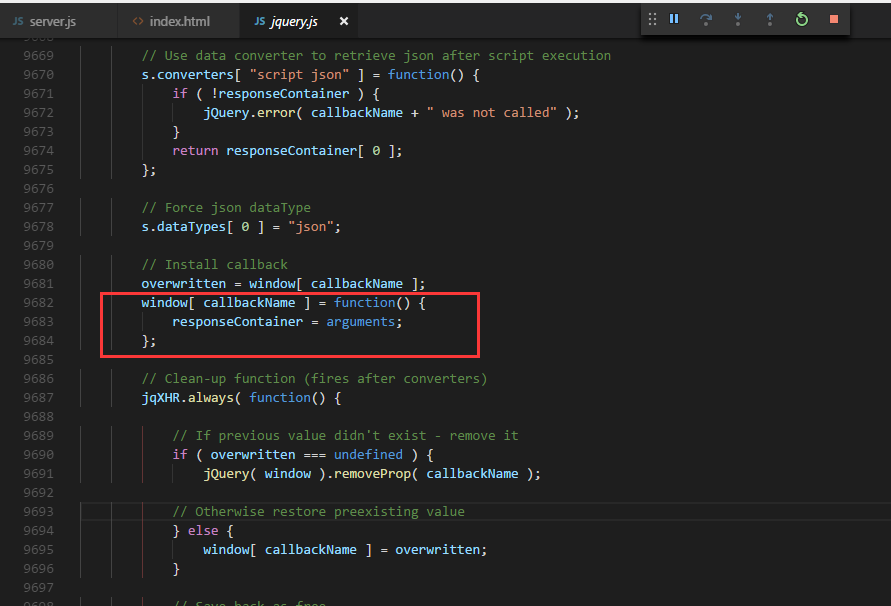
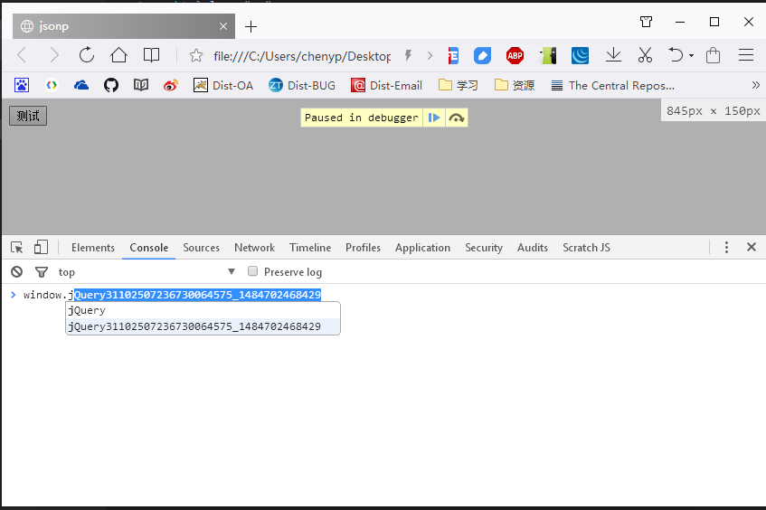

> jsonp的工作原理，归根结底一句话：`远程库可调用本地库或另一远程库中的方法。`它不是一种数据格式，更不是一种协议，仅仅只是一种数据调用方式。

当前端调用后台服务时，只要满足下列两种情况之一，都属于跨域调用：

- 不同服务器
- 同一服务器不同端口

跨域调用服务时，如果服务器没有返回相应的响应头信息或者特殊处理，通过ajax的方式无法取到数据，往往会报如下的错误：



> 只有ajax的调用方式无法获取到数据，其它方式如浏览器直接访问，java请求等都是可以正常取到数据的。也就是说，是浏览器的安全策略导致的此问题。

值得注意的是，即使是跨域调用，前端发起的请求也可以到达服务器，服务器也会返回数据，只是浏览器会对服务器的响应做进一步的过滤：如果响应头中没有跨域相关的策略，就屏蔽掉此次响应，并给出上图中的错误提示。

因此，只要保证响应的头信息中添加了相应的策略即可解决掉跨域的问题，这是`正常且安全`的方式：服务是后台提供的，那么最好是后台决定谁可以调用。 (往往由于配置问题，即使你添加了相应的跨域策略，也可能会被覆盖掉)。那jsonp是什么回事？

jsonp是一个利用`<script>`标签没有跨域限制的"漏洞"来解决跨域问题的一种"不安全"的解决方式。因为只要后台支持jsonp了，那就意味着任何人都可以随意调用，后台已经控制不了。

下面的这个例子演示jsonp的原理：

-  某服务器下的 a.js 文件

```js
var data = {"data":"Hello World"}; 
demo(data);
```

- 本地 index.html 文件

```html
<!DOCTYPE html>
<html lang="en">
<head>
    <meta charset="UTF-8">
    <title>jsonp</title>
</head>
<body>
    <script>
        function demo(data){
            console.log(data);
        }
    </script>
    <script type="text/javascript" src="http://www.itgo.club/a.js"></script>
</body>
</html>
```

上面的html文件引用了其它服务器上的一个a.js脚本文件，这个脚本文件不干任何事情，只是调用在html文件中定义的demo函数，预览此页面，控制台会正常输出数据。这也就说明，只要服务器将返回数据包装成一个本地函数的调用，通过此函数来接收服务器返回的数据即可进行跨域访问。（后台一样需要将数据包装成函数调用，很多人以为后台不做任何的改造就可以使用jsonp，这是不可能的）

当使用jquery提供的ajax相关函数，只要设置了`dataType: "jsonp"`参数，jquery会自动的生成一个用来接收数据的函数，如：
```js
$.ajax({
    type: "GET",
    url: "http://127.0.0.1:8080",
    dataType: "jsonp",
    success: function(e){
        console.log(e);
    },
    error : function(e) {
        console.log(e);
    }
}); 
```
实际上发起的请求地址为：
```
http://127.0.0.1:8080/?callback=jQuery31102507236730064575_1484702468429&_=1484702468430
```
服务端关键代码：
```js
const http = require('http');
http.createServer((req,res)=>{
    const params = req.url.substring(2).split("&");
    let paraMap = new Map();
    params.forEach(item => {
        let keyValuePair = item.split("=");
        paraMap.set(keyValuePair[0],keyValuePair[1]);
    });
    let callbackFunc = paraMap.get("callback");
    let data = JSON.stringify({
        data:`Hello World`
    });
    //如果请求参数中有callback参数,将数据通过函数调用的形式返回
    if(callbackFunc){
        res.writeHead(200);
        res.end(`${callbackFunc}(${data})`);
    }else{
        res.writeHead(200,{
            "Content-Type":"application/json;charset=utf-8",
            "Access-Control-Allow-Origin":"*"//允许所有的请求
        });
        res.end(data);
    }
}).listen(8080,'127.0.0.1',()=>{
    console.log(`访问地址：http://127.0.0.1:8080`);
});
```
根据上面的请求地址及上面的服务端代码，这个请求返回的内容如下图：



这里的`jQuery31102507236730064575_1484702468429`函数就是jquery自动生成的回调函数，这个函数会在服务器返回数据前注册到全局对象`window`下面，如下所示：





当通过此函数接收到服务器的数据之后，此函数会从全局对象下面删除掉，由此即可解决掉跨域的问题。

如果是自己写的服务，当然不建议这么做；倘若是别人的服务，而且响应头中的策略禁止了我的请求，那就可以用jsonp试试运气，如果没有针对jsonp的特殊处理，那你一样是取不到数据的。所以千万不要以为使用jsonp就可以解决掉跨域的问题，总结：
- jsonp只是一种函数调用方式
- jsonp虽然方便，但是不安全
- jsonp需要服务端进行改造，用传递的回调函数进行包装

> 可参考[示例代码](./jsonp-sample)进行测试。如果需要运行示例工程，请先执行`npm install`，然后通过`node server.js`或者`npm start`启动。
