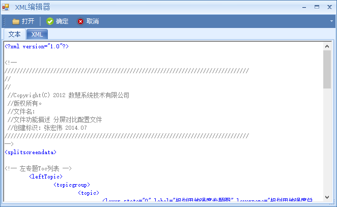
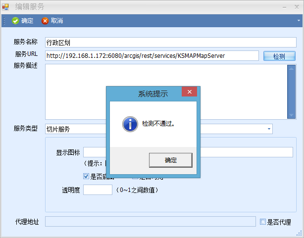
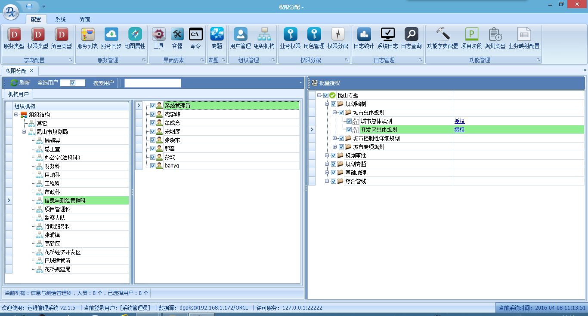
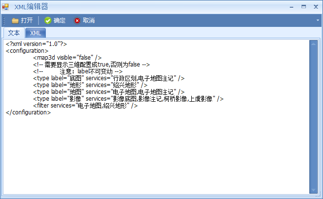
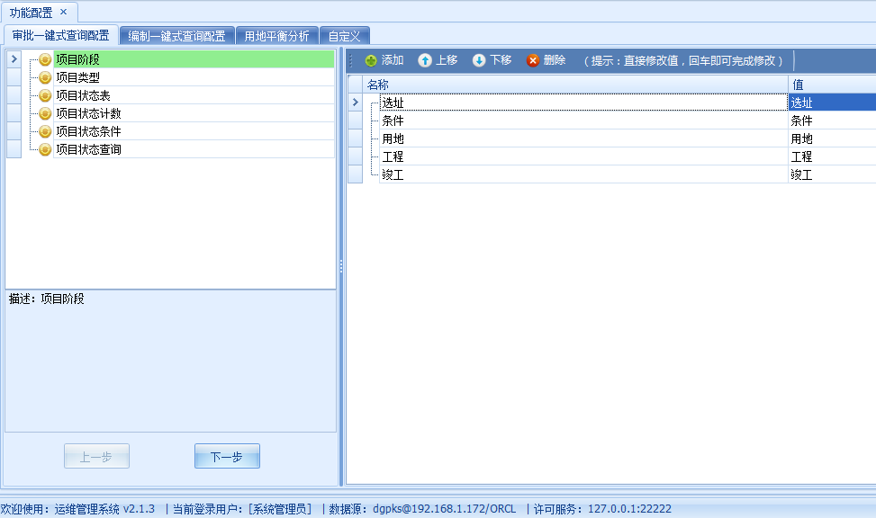
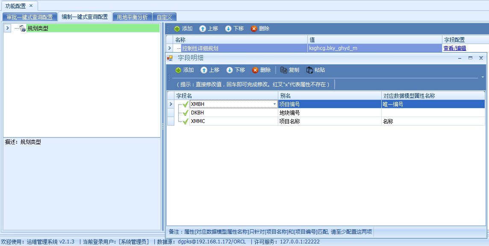

# 版本更新日志

>*author:yangmin*  
*date:2016/12/12 16:12:33*

## Version Matrix
|运维版本|发布时间|distprivilege.jar|distprivilege-dg.jar|
|:-------------|:------|:-----|:-----
|[2.2.6](#v226) |20161202| 1.0.7 |1.0.7 |
|[2.2.5](#v225) |20161107| 1.0.7 |
|[2.2.4](#v224) |20161012| 1.0.7 |
|[2.2.3](#v223) |20160909| 1.0.6 |
|[2.2.2](#v222) |20160729| 1.0.6 |
|[2.2.1](#v221) |20160715| 1.0.6 |
|[2.2.0](#v220) |20160701| 1.0.6 |
|[2.1.9](#v219) |20160617| 1.0.6 |
|[2.1.8](#v218) |20160520| 1.0.6 |
|[2.1.7](#v217) |20160506| 1.0.6 |
|[2.1.6](#v216) |20160422| 1.0.6 |
|[2.1.5](#v215) |20160408| 1.0.6 |
|[2.1.4](#v214) |20160311| 1.0.6 |
|[2.1.3](#v213) |20160226| 1.0.6 |
|[2.1.2](#v212) |20151225| 1.0.6 |
|[2.1.1](#v211) |20151016| 1.0.6 |
|[2.1.0](#v210) |20150911| 1.0.5 |
|[2.0.9](#v209) |20150828| 1.0.5 |
|[2.0.8](#v208) |20150814| 1.0.5 |
|[2.0.7](#v207) |20150731| 1.0.5 |
|[2.0.6](#v206) |20150710| 1.0.5 |
|[2.0.5](#v205) |20150522| 1.0.4 |
|[2.0.4](#v204) |20150510| 1.0.4 |
|[2.0.3](#v203) |20150423| 1.0.3 |
|[2.0.2](#v202) |20150411| 1.0.3 |
|[2.0.1](#v201) |20150327| 1.0.3 |
|[2.0.0](#v200) |20150313| 1.0.3 |

### V2.2.6
> 2016-11-29
>> `用户管理`导入用户信息功能异常修复；
>>
>> `结构组织`导入机构信息功能异常修复；
>>
>> `移动配置`保存配置信息功能异常修复；
>
> 2016-12-02
>> `服务列表`中代理服务url地址检测异常修复；
>>
>> `服务同步`中代理服务同步异常修复；

### V2.2.5
> 2016-11-04
>> `权限分配`模块中增加专题图层字段的权限控制功能；

### V2.2.4
> 2016-09-13
>> `工具`界面工具组新增`高亮图标`路径配置；**权限jar包修改，在权限文件privilege.xml`工具组`节点中新增`高亮图标`属性**；
>
> 2016-10-11
>> `专题`模块新增非空间数据专题（文件专题）；

### V2.2.3
> 2016-09-06
>> `工具`预加载类型新增“空白”选项；
>
> 2016-09-07
>> `工具`界面新增“鼠标加载图标”路径配置；**权限jar包修改，在权限文件privilege.xml`工具`节点中新增`高亮图标`和`鼠标加载图标`属性**；
>>
>> `日志`模块新增“移动日志查询”功能；

### V2.2.2
> 2016-07-25
>> `移动配置`界面优化，支持对多个服务图层的配置;
>>
>> `项目阶段`获取所有属性时，先判断是否有关联服务图层，有则获取其字段名和字段别名，无则直接获取空间图层的字段名作为别名;
>>
>> `项目阶段`编辑字段设置显示标题和关键字的bug修复;
>
> 2016-07-28
>> `服务同步`功能中支持图层i查询概要信息的配置;

### V2.2.1
> 2016-07-06
>> `服务同步`功能的优化，服务无组图层时右侧显示其图层信息，同时去掉下拉时没有数据的节点;
>
> 2016-07-08
>> `服务同步`中新加图层字段的配置，用于支持i查询字段的配置;
>
> 2016-07-14
>> `权限分配`中用户授权bug修复;
>>
>> `移动配置`界面和“设备管理”授权界面优化;

### V2.2.0
> 2016-06-20
>> 优化`移动设备`模块`移动配置`功能节点配置;
>>
>> `移动配置`功能中新增节点元数据（json格式）的保存功能;
>
> 2016-06-21
>> `专题`功能中新增专题目录`移动就绪`选项功能;
>
> 2016-06-22
>> `服务`中几何服务URL路径检测的bug修复;
>
> 2016-07-01
>> `移动设备`模块`设备管理`中新增移动设备的添加和编辑功能;

### V2.1.9
> 2016-06-14
>> 修复 `服务`编辑时保存url路径出错的bug;
>
> 2016-06-15
>> `移动设备`模块新加`移动配置`功能（*昆山项目需要*）;
>
> 2016-06-17
>> `移动设备`模块新加`移动版本信息管理`功能（*昆山项目需要*）;

### V2.1.8
> 2016-05-10
>> `服务列表`模块，修改服务的URL后，点击“确定”会自动批量修改功能配置（`工具`）中相应节点的URL值，并提示已更新成功多少个服务地址；
>
>>  优化`权限分配`”模块：  
>>> `组织机构`栏目默认全部展开；  
>>> 全选用户复选框允许勾选；  
>>> 用户列表加入复选框；  
>>> 去掉单个专题后的授权功能；  
>>> 将批量授权改为授权，其功能能实现对已选择的用户分配已勾选专题的权限；  
>>> 勾选了专题后，点击授权，弹出的专题页面里专题与前一阶段勾选的专题保持一致;
>
>> **数据库版本管理表创建语句**

        create table TBSYS_VERSION
        (
        F_VersionID   NUMBER(10) not null,
        F_VersionCode VARCHAR2(50),
        F_Description VARCHAR2(500)
        );

        comment on table TBSYS_VERSION
        is '数据库版本说明';
        comment on column TBSYS_VERSION.F_VersionCode
        is '数据库的版本编号';
        comment on column TBSYS_VERSION.F_Description
        is '数据库的版本说明';
        alter table tbsys_version
        add constraint tbsys_version_PK primary key (F_VersionID);

        create sequence SEQ_TBSYS_VERSION
        minvalue 1
        maxvalue 99999999999999999999999
        start with 1
        increment by 1
        cache 20;
>
> 2016-05-18
>> 添加`版本库管理`,管理业务库的版本信息，保持库与系统版本一致，方便后续升级跟踪;
>
>> 整合每个版本的升级脚本，在`版本库管理`界面可选择匹配的脚本进行升级;

### V2.1.7
> 2016-04-25
>> `服务列表`模块，修改服务的URL后，点击**确定**会自动批量修改功能配置（`工具`）中相应节点的URL值；
>
> 2016-04-26
>> `权限分配`模块，在批量授权开启后，新增关闭批量授权模式的按钮；
>
> 2016-04-27
>> `功能配置`模块，对字典表中的键值对进行判断，自动清除空格；
>
> 2016-05-05
>> `服务列表`模块，在`添加服务`和`编辑服务`界面添加获取服务对应MXD文档路径的功能；

### V2.1.6
> 2016-04-11
>> 运维系统**登录**时闪动现象优化；
>
>> 运维系统**登录时加载界面**的置前优化；
>
> 2016-04-12
>> 运维系统中`工具`模块`配置内容`XML编辑器中XML页面过滤注释节点；
>
> 2016-04-15
>> `权限分配`模块中点击`批量授权`后，用户列表的复选框出现，在单个专题授权时关闭；
>
> `权限分配`模块点击授权后弹出的界面中，将状态信息置顶显示，角色页面只显示中文，业务权限页面只列出名称；
>
> 2016-04-21
>> `服务同步`模块界面的重新设计，将原有的3个分块整合为2个，通过触发左侧的节点右侧展示不同的数据类型（*参考了ArcCatalog的设计方式*）。

### V2.1.5，20160408
> 2016-04-07
>> 运维系统中`工具`模块`配置内容`文本编辑功能的优化；  
>
>>
>
>> 运维系统中`服务`模块中`编辑服务`服务url路径检测的bug修复；  
>
>>
>
> 2016-04-08
>> 运维系统中`权限分配`模块`权限配置`界面调整；  
>
>>

### V2.1.4
> 2016-03-09
>> 运维系统中`工具`模块`配置内容`里支持文本编辑功能与XML功能**合并/优化**（*杭州项目使用*）;  
>
>>
>
> 2016-03-10
>> `功能配置`模块引入流程操作功能;  
>
>>
>
>> 将`功能字典`与`规划类型`功能整合;  
>
>>

### V2.1.3
> 2015-12-30
>>`限分配中`加入了跨专题方案进行多项选择的功能（*在常州项目使用*）。
>
> 2016-01-27
>> 修改`添加专题`崩溃的bug:专题添加后自动刷新失败（**修改好方案后，需点击保存专题按钮才能保存修改**）;
>
>> 运维`日志模块`添加`图幅日志`查看功能（*余姚、昆山项目使用*）;
>> **说明**：由于图幅日志查看功能部分项目中不需要使用，所以dgp.config中没有配置；
>>          如果需要使用，需先执行数据库脚本文件PCK_QueryStat_Log（在），然后修改dgp.config文件，大约45行处，将`图幅使用`加入到日志类型中
>>          `<add key="LogType" value="登录信息;功能使用;专题访问;图幅使用"/>`；此外，在一张图后台系统中也需要集成相关代码。
>
> 2016-02-26
>> 给已发布的服务图层添加`图层别名字段`（*杭州项目使用*）;

### V2.1.2
> 2015-12-03
>> 系统登录时，把主界面做了**隐藏**，只保留了一个登录窗口，避免实施人员的误操作;
>
> 2015-12-24
>> 修改`日志统计`模块的bug(**图生成失败**);

### V2.1.1
> 2015-09-23
>> 完善`用户机构`配置，选择根节点，把所有用户显示出来；
>
> 2015-09-28
>> 完善删除`功能字典`，**级联删除**业务映射关系的脏数据；
>
> 2015-09-29
>> 给`服务`添加`代理信息`配置（*在西安项目使用*）；
>
> 2015-10-09
>> 修改`服务同步`模块bug：有些服务同步失败问题；
>
> 2015-10-13
>> 修改`专题`模块bug：解决专题目录拖拽失败的问题；

### V2.1.0
> 2015-09-08
>> 新增一些数据模型，主要是为了满足与规管进行项目信息同步使用；
>>>    sys_dic_prjname：存储项目在每个业务审批阶段的名称（有可能会不一样）；  
>>>    sys_dic_prjstagemap：存储规管业务和gis业务的映射关系；  
>>>    sys_dic_prjstagerecord：记录项目每个阶段的信息；  
>>>    sys_dic_prjstate：存储项目的最新状态信息；  
>
>> 添加规管业务和gis业务映射关系的配置；

### V2.0.9
> 2015-08-19
>> 修复`工具`和`容器`配置内容xml的bug：`缺失根元素`的提示
>
> 2015-08-21
>> `工具`和`容器`功能里专题图标多级路径配置，使用**“/”**作为多级目录标识，如果标识符错误，运维给予错误提醒，并将错误符号自动替换为**“/”**。
>
>> `规划类型`字段类型有效性验证：如果新增字段验证失败，自动删除新增的空字段记录;目前空记录是存在的;
>> `项目阶段`字段类型有效性验证：如果新增字段验证失败，自动删除新增的空字段记录;目前空记录是存在的。
>
>> 给`专题`添加`要素图层`的功能优化；

### V2.0.8
> 2015-08-03
>> 修改`功能配置`的字段配置bug：遇到不支持的 Oracle 数据类型 USERDEFINED；
>
> 2015-08-05
>> `工具`和`容器`的`配置文内容`界面化；
>
>> 修改`用户管理`模块导出用户功能bug：admin导不出;
>
> 2015-08-06
>> 完善`容器`和`工具`模块，删除实体的时候级联删除相关的数据，避免垃圾数据遗留；
>
> 2015-08-11
>> 关于`工具`，`容器`，`专题`的图标多级路径的配置方法，使用**“/”**作为多级目录标识，不能使用**“\”**，需要进行非法检测，如果标识符错误，不能保存。
>
>> `项目阶段`字段类型有效性验证：如果验证失败，直接提示错误，不允许内容输;
>
>> `规划类型`字段类型有效性验证：如果验证失败，直接提示错误，不允许内容输入;
>
>> 给`专题`添加`要素图层`的功能优化：点击加载，再点击不加载（**目前以勾选为状态切换**）;
>
>> 修改`服务列表`模块，添加的同时，提供同步服务，不需要切换到同步服务模块；

### V2.0.7
> 2015-07-22
>> 在`地图服务`属性中添加一个`透明度`的设置;
>
>> 在`功能配置`模块，修改`规划类型`字段配置，可以灵活选择功能字段;
>
>> 修改运维bug，`权限分配`->`可视范围`选择grouplayer后，选不了要素图层的bug；
>
> 2015-07-23
>> 去掉`工具`的一些属性，避免误导配置人员;
>
> 2015-07-28
>> 在`功能配置`的`项目阶段编辑字段`中，添加**获取所有属性**的功能，一次性把所有属性都同步过来，避免一个一个手动添加；
>
> 2015-07-30
>> 修改`阶段字段`和`规划类型字段`配置模块，添加**属性有效验证**功能，快速让配置人员知道哪个属性配置错误;

### V2.0.6
> 2015-06-17
>> 修改`工具`模块和`容器`模块，开放`配置内容`的可编辑；
>
> 2015-06-26
>> 修改`容器``编辑`模块，**添加工具**时，提示信息不正确的bug；
>
> 2015-06-27
>> 修改`专题`模块、`工具`模块和`容器`模块，添加一些提示信息，以免配置容易出错;
>
>> 关于`工具`，`容器`，`专题`的图标多级路径的配置方法，使用**“/”**作为多级目录标识，不能使用**“\”**;
>
> 2015-07-06
>> 在`地图服务`中添加`导出图片类型`，支撑前端灵活导出地图图片类型；
>
> 2015-07-08
>> 在`专题`配置模块，添加一些操作提示说明，以免导致操作不当；
>
>> 添加**导出方案**的功能，以共享给其它项目重复使用；
>
>> 添加**数据源配置的历史记录**功能，方便快速查找到已经使用过的数据源；

### V2.0.5
> 2015-05-14
>> 修改`服务同步`模块，切换服务的时候，修改在服务根目录要素图层未能显示的bug；
>
>> 修改数据库配置测试的底层依赖dll，原来引用微软的System.Data.OracleClient，现在修改成oracle提供的客户端dll：Oracle.DataAccess.dll
>> 原来bug：只要用户名或者密码错误，都会导致系统崩溃。
>
> 2015-05-18
>> 继续承接上次对底层数据库连接的修改。还是依赖System.Data.OracleClient.dll，不用Oracle.DataAccess.dll，另外添加了oracle绿色客户端的集成：instantclient_11_2，已经通过测试。
>> 不管是输错了用户名或者密码，都不会出现系统直接崩溃的问题。
>> 如果想通过tns连接，则需要修改安装版本目录下的文件：instantclient_11_2\Network\Admin\tnsnames.ora
>> 在里面添加响应的连接说明，如下：  
    `ORCL188 =
        (DESCRIPTION =             
            (ADDRESS_LIST = 
                (ADDRESS = (PROTOCOL = TCP)(HOST = 192.168.1.188 )(PORT = 1521))              
            )              
            (CONNECT_DATA =                 
                (SERVICE_NAME = ORCL   )              
            ) 
        )`
>
>> 解决系统安装目录不能带有英文字符括号"( )"的bug；

### V2.0.4
> 2015-04-27
>> 修改用户管理模块，全选用户后，点击删除后，报错的bug；
>
> 2015-05-06
>> 修改`专题`模块，完善导入`服务`的功能；
>
>> 添加`移动设备`的管理配置；

### V2.0.3
> 2015-04-15
>> 修改`用户管理`模块的添加用户密码未能正确解密的bug问题；
>
> 2015-04-23
>> 在`工具`模块，修复添加工具或者目录错乱bug；
>
>> 在`工具`模块，修改拖拽失败bug；
>
>> `用户管理`模块，修改`全选`后弹出错误信息bug；
>
>> `业务权限`模块，在资源分配中，切换容器、工具和命令时，修改全选的状态；
>
>> `命令插件`管理，默认组别下拉框为空，修改点击添加命令报错bug；
>
>> 修改`服务类型、权限类型、角色类型、业务权限、角色管理、功能字典`这几个的编辑状态；

### V2.0.2
> 2015-04-03
>> 在`专题`属性里添加`移动就绪`。值为1：表示在移动端显示；0：表示不在移动端显示；
>
>> 在`专题`配置模块，给方案添加查看或者编辑`元数据`的功能，让管理员直观看到生成XML格式；
>
> 2015-04-08
>> 修改bug，`服务同步`模块。手动删除组图层失败的bug；
>
>> 修改bug，`专题`模块添加图层的时候，勾选组图层的情况，无法把其下的要素图层添加到专题的bug；
>
> 2015-04-10
>> 修改`功能字典`模块中的`用地平衡`，添加指定用地代码字段的功能，中间用&分割；
>
>> 在`项目阶段`模块的`编辑字段`，添加`显示在标题`和`关键字`的选择。`显示在标题`表示这个属性被显示在标题列表中；`关键字`表示这个属性作为定位的关键属性；

### V2.0.1
> 2015-03-16
>> 在`服务列表`模块，在搜索服务功能里增加快速添加服务功能`添加到...`;
>
> 2015-03-24
>> 在`专题`配置模块，添加图层后不记录上一步的操作状态；
>
> 2015-03-26
>> 修改`容器`模块的视图编辑状态；
>
>> 修改`用户视图`以首字母展示；
>
>> 在`用户管理`模块，添加双击事件即可弹出编辑窗口；
>
>> 完善`用户信息编辑`模块；
>
>> 在主界面的状态栏添加了`数据源和许可服务连接信息`；

### V2.0.0
>> 注意，以下版本需要先执行升级脚本：  
    `[
    --把`工具`或者`容器`的配置信息存入库中
    -- Add/modify columns 
    alter table SYS_GIS_TOOL add CONFIGcontent clob;
    -- Add comments to the columns 
    comment on column SYS_GIS_TOOL.CONFIGcontent
    is '配置文件内容';
    
    -- Add/modify columns 
    alter table SYS_GIS_CONTAINER add configcontent clob;
    -- Add comments to the columns 
    comment on column SYS_GIS_CONTAINER.configcontent
    is '配置文件内容';
    ]`
>
> 2015-02-03  
>> 在`组织机构`配置中，添加`刷新`功能；
>
> 2015-02-04  
>> 在`服务列表`模块，添加`是否底图`和`是否可见`列表显示；
>
> 2015-02-05
>> `专题类型`标签里，给专题配置要素图层时先选服务，建议这里设置成**默认上次所选择的服务**;
>
> 2015-02-09
>> 解决bug：值不能为空，参数名：key；
>
> 2015-02-28
>> 修改`权限分配`模块中可视范围的bug；
>
> 2015-03-03
>> 在`容器`中配置工具的时候，一个工具只能被配置到一个容器中，不能重复添加。解决前台不显示重复工具的bug；
>
> 2015-03-04
>> 修改底层数据库连接方式，去掉第三方工具ddtek，引入微软的ado.net连接数据库，支持oracle实例连接和oracle服务命名连接；
>
>> 修改`数据源配置项`，把以前的子项：服务器、oracle实例名和端口，合并为“数据库”，方便灵活填写数据库地址信息；
>
>> 给`工具`和`容器`添加`配置内容`，把以前每个工具个性化的配置信息存入库中；
>
>> 修改运维底层框架，预研集成绿色oracle客户端；
>
> 2015-03-05
>> 集成绿色oracle客户端，测试通过;
>
>>  可通过两种方式连接数据库：
>>> 通过SID方式，在登录界面的配置功能，通过填写`数据库`项，格式：ip:端口/SID；
>>> 通过服务命名方式，编辑版本文件夹`oracle`的文件`tnsnames.ora`，按照以下格式添加客户现场的oracle配置信息：  
    `ORCL188 =
    (DESCRIPTION =
        (ADDRESS_LIST =
        (ADDRESS = (PROTOCOL = TCP)(HOST = 192.168.1.188)(PORT = 1521))
        )
        (CONNECT_DATA =
        (SERVICE_NAME = orcl)
        )
    ) `   
>>> 然后在登录界面的配置功能，通过填写`数据库`项，格式：oracle服务名称。如上示例，应填入：orcl188，即可。
>
> 2015-03-06
>> 修改`权限控制`模块，定位范围设置，如果坐标xy都不填，则认为数据为空，不存入库；
>
> 2015-03-09
>> 修改`专题`中添加图层的方式，如果取消grouplayer的勾选，则子图层一样保留，只是同步取消子图层的勾选状态；
>
>> 修改数据源设置不成功的bug；
>
> 2015-03-11
>> 修改`地图属性`配置页面的文字描述，便于配置人员理解；
>
> 2015-03-12
>> 注意：在不同电脑测试，发现安装目录不能带有括号()；
>
>> 修改服务删除模块的警示提示，提高误删的警觉性；
>
>> 修改运维批量删除服务，如果多个服务一起删除，则只有一个进度框弹出（以前情况是每删除一个服务，则弹出一个进度框），提高体验；
>
> 2015-03-13
>> 在`权限分配`模块，添加搜索用户的功能，以便快速找到用户进行个人权限配置；

